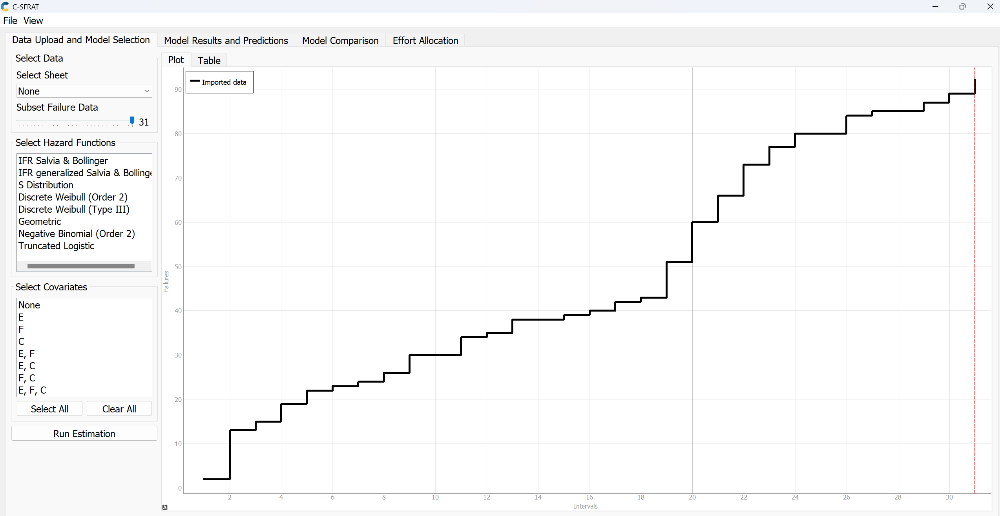
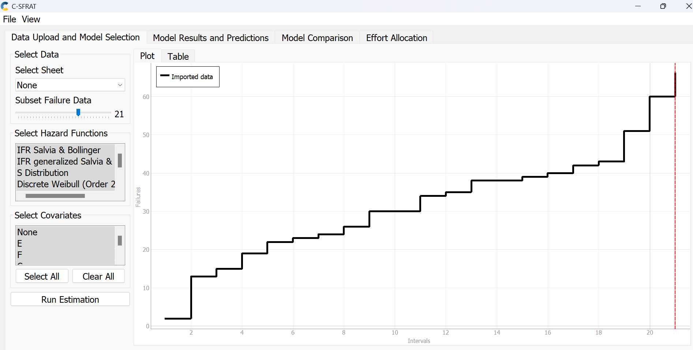
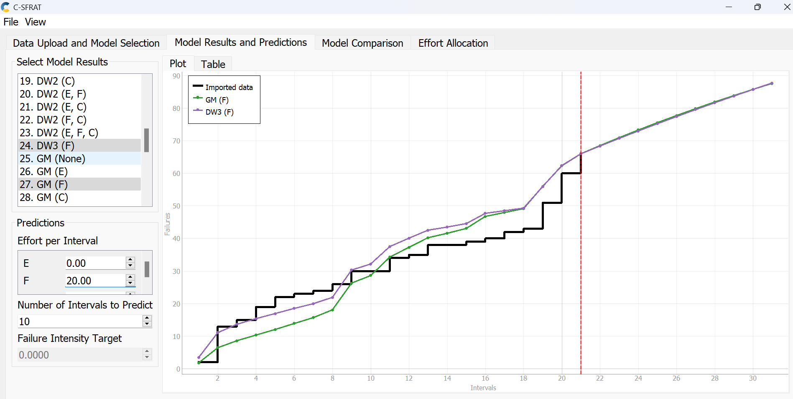

**SENG 637- Dependability and Reliability of Software Systems***

**Lab. Report \#5 – Software Reliability Assessment**

| Group \#:       |   |
|-----------------|---|
| Student Names:  |   |
|                 |   |
|                 |   |
|                 |   |

# Introduction

# 

# Assessment Using Reliability Growth Testing 
### TOOL USED: C-SFRAT
We chose to use the C-SFRAT analysis tool because it is well-regarded for its ability to model reliability growth through statistical methods. The C-SFRAT GUI allows us to input the failure data, apply different models, and visualize results through graphs and charts. We found this easier to use and manage compared to other more code-intensive tools.
### RUNNING THE TOOL:
1. We first uploaded the failure data into the C-SFRAT tool. We then activated all the available Hazard Functions and Covariates listed in the tool and launched the estimation process. This resulted in the first plot of cumulative failures. 
2. After running the tool, it generated every possible combination of the hazard functions with the covariates. This resulted in an extensive list of models to see how they stacked up against each other.  
3. We decided to use the Akaike Information Criterion (AIC) and Bayesian Information Criterion (BIC) to judge the model's effectiveness. These criteria help us assess each model's fit while also considering the complexity - essentially penalizing models that are overly complex. 
4. We narrowed down our choices based on the AIC and BIC scores, opting for the models that offered the best balance between accuracy and simplicity. 
5. From our analysis, the DW3 model with the F covariate and the GM model with the F covariate stood out as having the lowest AIC and BIC scores, making them our top picks for handling our failure data. 
6. With these models selected, we moved into a phase of experimentation to fine-tune our approach, involving selecting the most relevant Subset of Failure Data and adjusting the prediction settings, including the Effort per Interval and the Number of Intervals to Predict. 
7. Our original failure dataset comprised 31 data points. Through trial and error, we determined that a subset of 21 data points, combined with setting the Effort per Interval at 20 and choosing 10 as the Number of Intervals to Predict, gave us the most reliable results.  
8. Following these adjustments, we were able to view the time-between-failures and intensity graphs.  

### ANALYSIS BASED ON ABOVE GRAPHS:

| | Total Failures | Failure Rate (λ) = Total Failures / Time Interval | MTTF = 1 / λ |
| ------------- | ------- | -------- | ------- |
| Imported Dataset | 92 | 92/31 = 2.9677 | 1/2.9677 = 0.3370 |
| Model-DW3 with F covariate | 89 | 89/31 = 2.8710 | 1/2.8710 = 0.3483 |
| Model-GM with F covariate | 89 | 89/31 = 2.8710 | 1/2.8710 = 0.3483 |

### COMMENTS ON THE RESULT OBTAINED:
* Range Selection:

    * We see in the graph that the initial 18 data points show consistency in failure occurrences. Then we notice a cluster of 4 spikes i.e., a surge in failures, which probably may be an anomaly in the dataset. Beyond these, the subsequent 9 points show a steadier state similar to the earlier pattern of stability. 
    * Our range of the subset just so happens to be the average of those 4 spikes rather than letting them skew the overall trend. The general performance is shown by the before and after stable periods, indicating the reliability trend without the distortion of the sporadic outbursts. 
* Comparing the failure rate (2.8710) of the 2 models with the original dataset (2.9677) shows a slight decrease in the value, probably indicating the effect of Effort (F covariance) in reliability. 
* Comparing the MTTF values shows a slight uptick in the models (0.3483 vs 0.3370 of the original data), probably indicating improvements in the reliability taking into account the Effort. 

# Discussion on decision making given a target failure rate
Let us assume our target failure rate is 3. The original dataset shows a failure rate of 2.9677, and both the DW3 and GM models indicate a slightly lower rate of 2.8710. This suggests that we're currently performing well. By examining the trends from both models, we can pinpoint the conditions under which the failure rate might reach or go beyond our target. Understanding these conditions will help us identify any potential risks that could increase the failure rate. 
# Advantages and Disadvantages of Reliability Growth Testing (RGT)
* Advantages:
    * RGT offers predictive modeling tools to predict the future reliability.
    * It provides documented proof of reliability improvements. 
* Disadvantages:
    * It can be time-intensive. It requires several rounds of testing and failure analysis to see improvements in reliability.
    * Interpreting RGT data involves understanding the model chosen and understanding the failures and outliers

# Assessment Using Reliability Demonstration Chart 

# 

# Comparison of Results

# Discussion on Similarity and Differences of the Two Techniques
- Reliability Growth Testing (RGT) and Reliability Demonstration Chart (RDC): 
    * Similarities:
        * Both RGT and RDC focus on checking and displaying the reliability of a system.
        * Both use data from tests or past performance to judge the system reliability.
        * Both use graphical representation to visualize reliability requirement. 
        * ........ INCLUDE POINTS FOR RDC ..................
    * Differences: 
        * RGT is an iterative process requiring continuous testing and frequent updates to the model.
        * RGT helps in forecasting the system's reliability down the line.
        * While still being developed, it tracks and shapes how the system becomes more reliable as time goes on. 
        * ...... INCLUDE POINTS FOR RDC .........

# How the team work/effort was divided and managed

# 

# Difficulties encountered, challenges overcome, and lessons learned

# Comments/feedback on the lab itself
