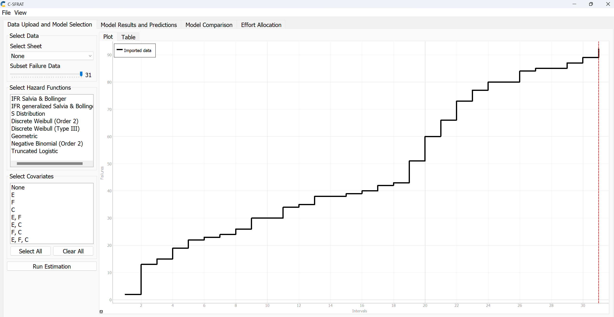
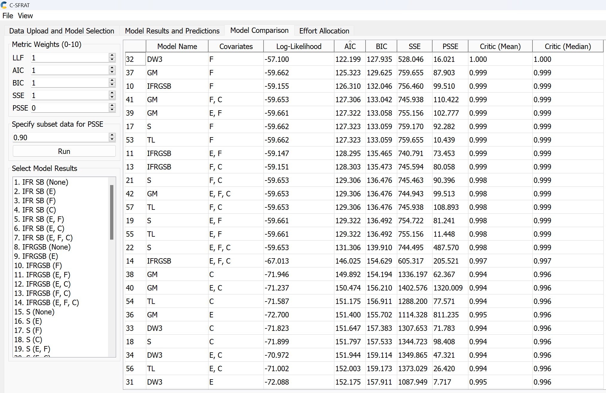
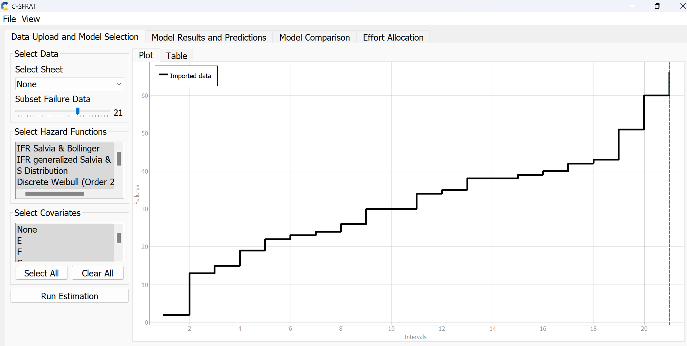
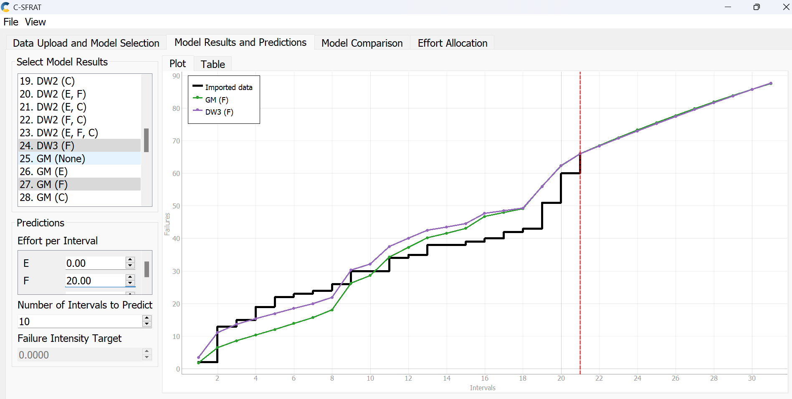
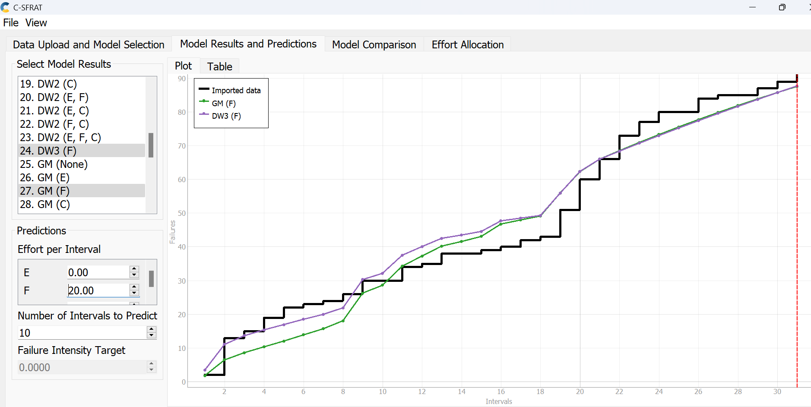
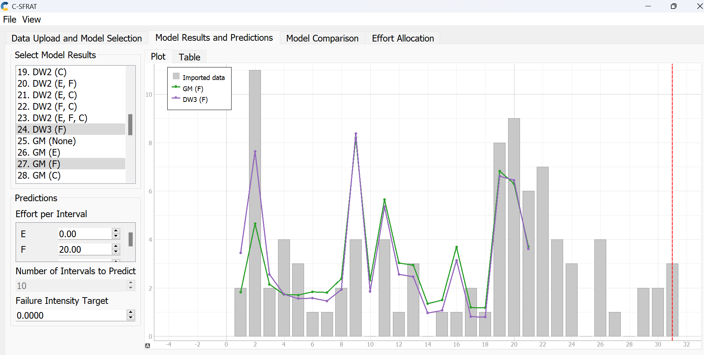

**SENG 637- Dependability and Reliability of Software Systems**

**Lab. Report \#5 – Software Reliability Assessment**

| Group \#:   3   |  
|-----------------|
| Aemen           |   
| Jauhar          |   
| Muiz            |   
| Shaun           |   
| Soumini         |   

# Introduction
This assignment has enhanced our understanding about integrating test data using reliability assessment tools. The first part of this lab includes Reliability growth testing by which we gained hands-on experience on assessing the reliability of a hypothetical system. Here we had to perform Reliability growth testing using Software Reliability and Testing Analysis Tool( SRTAT) on the given set of failure data. At the end of this test we were able to measure the failure rate, MTTF and reliability of the SUT through analyzing the test data.

The second part of this lab consisted of Reliability assessment using Reliability Demonstration Chart(RDC). This part focuses on identify the target MTTF, plotting the failure points in RDC and analysing the trend. Further different MTTF values were set to test if the SUT is acceptable by observing the plot.

# Assessment Using Reliability Growth Testing 
### TOOL USED: C-SFRAT
We chose to use the C-SFRAT analysis tool because it is well-regarded for its ability to model reliability growth through statistical methods. The C-SFRAT GUI allows us to input the failure data, apply different models, and visualize results through graphs and charts. We found this easier to use and manage compared to other more code-intensive tools.
### RUNNING THE TOOL:
1. We first uploaded the failure data into the C-SFRAT tool. We then activated all the available Hazard Functions and Covariates listed in the tool and launched the estimation process. This resulted in the first plot of cumulative failures. 
2. After running the tool, it generated every possible combination of the hazard functions with the covariates. This resulted in an extensive list of models to see how they stacked up against each other.  
3. We decided to use the Akaike Information Criterion (AIC) and Bayesian Information Criterion (BIC) to judge the model's effectiveness. These criteria help us assess each model's fit while also considering the complexity - essentially penalizing models that are overly complex. 
4. We narrowed down our choices based on the AIC and BIC scores, opting for the models that offered the best balance between accuracy and simplicity. 
5. From our analysis, the DW3 model with the F covariate and the GM model with the F covariate stood out as having the lowest AIC and BIC scores, making them our top picks for handling our failure data. 
6. With these models selected, we moved into a phase of experimentation to fine-tune our approach, involving selecting the most relevant Subset of Failure Data and adjusting the prediction settings, including the Effort per Interval and the Number of Intervals to Predict. 
7. Our original failure dataset comprised 31 data points. Through trial and error, we determined that a subset of 21 data points, combined with setting the Effort per Interval at 20 and choosing 10 as the Number of Intervals to Predict, gave us the most reliable results.  
8. Following these adjustments, we were able to view the time-between-failures and intensity graphs.  

### ANALYSIS BASED ON ABOVE GRAPHS:

| | Total Failures | Failure Rate (λ) = Total Failures / Time Interval | MTTF = 1 / λ |
| ------------- | ------- | -------- | ------- |
| Imported Dataset | 92 | 92/31 = 2.9677 | 1/2.9677 = 0.3370 |
| Model-DW3 with F covariate | 89 | 89/31 = 2.8710 | 1/2.8710 = 0.3483 |
| Model-GM with F covariate | 89 | 89/31 = 2.8710 | 1/2.8710 = 0.3483 |

### COMMENTS ON THE RESULT OBTAINED:
* Range Selection:

    * We see in the graph that the initial 18 data points show consistency in failure occurrences. Then we notice a cluster of 4 spikes i.e., a surge in failures, which probably may be an anomaly in the dataset. Beyond these, the subsequent 9 points show a steadier state similar to the earlier pattern of stability. 
    * Our range of the subset just so happens to be the average of those 4 spikes rather than letting them skew the overall trend. The general performance is shown by the before and after stable periods, indicating the reliability trend without the distortion of the sporadic outbursts. 
* Comparing the failure rate (2.8710) of the 2 models with the original dataset (2.9677) shows a slight decrease in the value, probably indicating the effect of Effort (F covariance) in reliability. 
* Comparing the MTTF values shows a slight uptick in the models (0.3483 vs 0.3370 of the original data), probably indicating improvements in the reliability taking into account the Effort. 

## Discussion on decision making given a target failure rate
Let us assume our target failure rate is 3. The original dataset shows a failure rate of 2.9677, and both the DW3 and GM models indicate a slightly lower rate of 2.8710. This suggests that we're currently performing well. By examining the trends from both models, we can pinpoint the conditions under which the failure rate might reach or go beyond our target. Understanding these conditions will help us identify any potential risks that could increase the failure rate. 
## Advantages and Disadvantages of Reliability Growth Testing (RGT)
* Advantages:
    * RGT offers predictive modeling tools to predict the future reliability.
    * It provides documented proof of reliability improvements. 
* Disadvantages:
    * It can be time-intensive. It requires several rounds of testing and failure analysis to see improvements in reliability.
    * Interpreting RGT data involves understanding the model chosen and understanding the failures and outliers

# Assessment Using Reliability Demonstration Chart 

## RDC Plots

The given failure data had to be modified before plotting. As the data was given as failures per interval, not time between failures. This was done by assuming failures were uniformly distributed in each interval. For example, if given data is:

| T |FC|
|---|---|
| 1 | 2 |
| 2 | 3 |

Then it would be converted into time between failures and further converted to cumulative time as follows. At T=1, there are two failures, it can be assumed that one failure is at T=0.5 and the other is at T=1.  At T=2, there are three failures, it can be assumed that one failure is at T=1.33, second failure at T=1.67 and the last failure at T=2.

| Cumulative Failure Count | Time Between Failures | Cumulative Time |
|--------------------------|-----------------------|-----------------|
| 1 | 0.5  | 0.5  |
| 2 | 0.5  | 1    |
| 3 | 0.33 | 1.33 |
| 4 | 0.33 | 1.67 |
| 5 | 0.33 | 2    |

* The first plot below shows the RDC graph using the calculated MTTF of the SUT, FIO = 200 failures/31 intervals = 6.452, giving MTTF = 1/6.452 = 0.155

* In the second plot it was determined that the FIO was 375/31 = 12.097 failures per interval. Giving a MTTF of 0.083. We can continue tests to determine when the system will reach an acceptable condition.

* Here, we determined with an FIO of 500/31 = 16.129 and an MTTF = 0.062 that we are in the acceptable region.

* If we take double the MTTF value and have a FIO value of 1000/31 = 32.258 we are completely in the acceptable region.

## Evaluation and Justification for MTTFmin

MTTFmin is the minimum acceptable level of reliability in an SUT. It is the threshold that determines that the system is not longer reliable. The MTTFmin was determined by calculating the Failure Intensity Observation (FIO) using the formula: FIO = Total Failures / Number of Intervals. The RDC was then plotted showing the observed failures in a Reject, Continue or Accept state, which described the state of the SUT reliability. After the graphs were created, they were analyzed and the graph with the accept state was determined. The corresponding MTTF calculated using the FIO was then determined as the MTTFmin. This was determined to be 0.062, since the SUT was in an acceptable range and it was the least possible threshold where it would be. Anything below this was in an unacceptable range for reliablity.

## Advantages and Disadvantages of RDC

### Advantages
- RDC analysis is very versatile.
- It is also time and cost efficient.
- Experimenting with different values of confidence is possible with RDC
- MTTF what-if scenarios can also be experimented with
### Disadvantages
- It cannot be used to calculate the exact quantitative values for the
reliability or availability of the SUT
- RDC can only indicate that the SUT is acceptable or not

# Comparison of Results

When comparing the results for both part 1 and 2, the total failures in the dataset were determined to be 92 for part 1. The time interval was 31. From this, it was determined that the failure rate was 2.9677 and the MTTF was 0.3370. For part 2, this data was slighlt modified. Since the data was failures per interval, it was changed to time between failures. Due to this, there were 200 failures over 31 intervals, with a failure rate of 6.452 and an MTTF of 0.155. In part 1, the failure rate of both models was determined to be 2.8710, wiht total failures of 89 and MTTF of 0.3483. The failures were reduced with these models. For Part 2, the failure rate for the second plot was 12.097 with an MTTF of 0.083. The failure rate for the third plot was 16.129 with an MTTF of 0.062. This was determined to be the acceptable range. Lastly, the failure rate for the fourth plot was 32.258. Comparing both results, the failure rate in part 1 was decreased with an increased MTTF for the three models. On the other hand, in part 2 the failure rate increased for each of the plots as the MTTF decreased. This was because we were trying to determine the least MTTF possible for the system to still be deemed reliable. This caused us to increase failure rate, whereas we decreased failure rate in part 1 to limit failure rate from going beyond the target.

# Discussion on Similarity and Differences of the Two Techniques

- Reliability Growth Testing (RGT) and Reliability Demonstration Chart (RDC): 
    * Similarities:
        * Both RGT and RDC focus on checking and displaying the reliability of a system.
        * Both use data from tests or past performance to judge the system reliability.
        * Both use graphical representation to visualize reliability requirement.
        * Both methods are decision support tools.
        * Both RGT and RDC assess ad manage required level of reliability.
          
    * Differences: 
        * RGT is an iterative process requiring continuous testing and frequent updates to the model.
        * RGT helps in forecasting the system's reliability down the line.
        * While still being developed, it tracks and shapes how the system becomes more reliable as time goes on. 
        * RDC is mostly used when failure data is limited to a few failures, time of failures are known, and one wants to find out what is the trend for reliability of the system
        * When it comes to resource utilization and time, RDC is more efficient.
        * RGT does not provide predictive insights into future improvements of reliability and failure.

# How the team work/effort was divided and managed

The team was organized into two groups for collaborative coding efforts: 1) Soumini & Aemen, 2) Muiz, Fathima, Shaun. The division of work within the groups is as follows:

- Soumini & Aemen collaborated on performing the reliability growth testing.
- Muiz, Shaun and Fathima collaborated on performing the Reliability Demonstration Chart.

Additionally, the report was a collective effort. The team convened over a virtual call to finalize and complete it collaboratively.

# Difficulties encountered, challenges overcome, and lessons learned

One of the main difficulties we had in this assignment was understanding the formulas that were supposed to be utiliized in the reliability growth testing. Understanding these formulas was essential to select the minimum MTTFmin score that made the SUT acceptable. Due to this, more time was focused on this and the formulas were researched extensively. An important lesson learned was how to use SRTAT, C-SFRAT and RDC. It was interesting to observe that as the MTTF decreased, the failure data points approached the acceptance threshold for failure intensity.

# Comments/feedback on the lab itself
What we...

- **Liked:** Working with multiple reliability assessment tools to assess failure data.
- **Disliked:** Some of the tools were a hit or miss and other tools sometimes needed to be employed.
- **Found Interesting:** It was interesting to observe that as the MTTF decreased, the failure data points approached the acceptance threshold for failure intensity.
- **Found Confusing:** Sometimes, running C-SFRAT was confusing and to further understand it, the tool guide needed to be studies thoroughly.
- **Found Challenging:** The biggest challenge was to understand the given formulas in RDC tool.
- **Found Motivating:** It was motivating how the behavior of the plots often mimicked what was predicted by the group.
